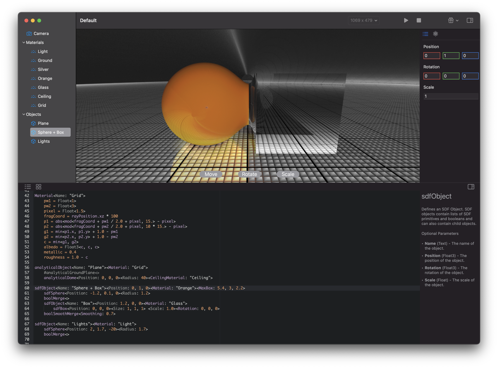

# Signed

## Abstract

Signed will be an GPL licensed editor and renderer for procedural Signed Distance Functions (SDFs). Signed will be available for macOS and iOS and is heavily optimized for Metal.

Signed features workflows for developers via a meta language which gets compiled to Metal (and in some cases to the CPU), but will also feature artist workflows via nodes and artist specfic tools for modeling.

Signed uses an Principled BSDF path tracer for rendering.

## Features

* A meta language describing procedural materials and objects with a flexible variable system which allows sharing of information between the different render and modeling stages.

* A node representation of the meta language for artists (todo).

* Various artist tools specific for modeling (todo).

* A large library of procedural materials and objects (todo).

* A terrain editor and renderer (todo).

* and a lot more.

## Sponsors

Sponsors for this project are very welcome.

## Status

Signed is currently in v0.2 and is estimated to go into v1 in the middle of this year.